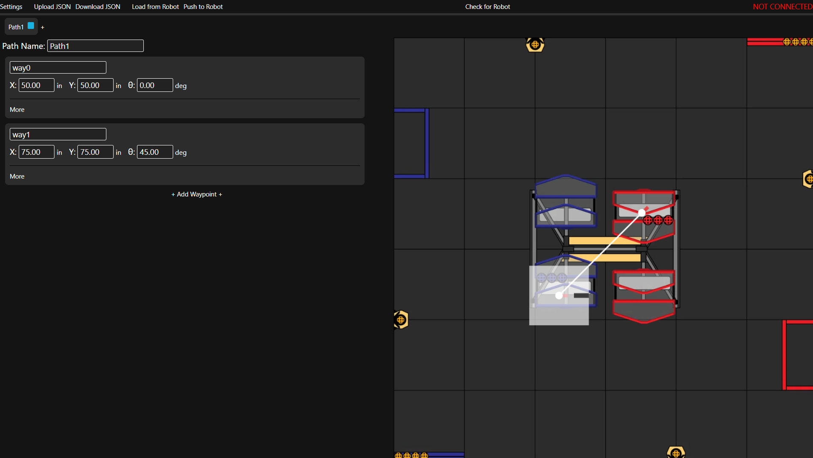

# LiveWIRE Pathing Visualizer
A visualizer/tool for creating/sending paths to an FTC robot. It uses ADB to send and load paths to
the control hub. This software is used in conjunction with FTC 30564's custom pathing software/library, LiveWIRE.

## Features
- Intuitive UI for creating and adjusting paths
- Accurate path animation following acceleration/deceleration/velocity constraints
- Paths downloadable to JSON and can be uploaded back into the software
- Paths can be generated into Java
- Paths can be loaded from robot, adjusted, and sent back without ever having to upload robot code (via ADB)
- Multiple paths viewable at once and can easily switch between them

## Coming soon
- Mirroring tools to easily flip across alliances
- Field Constants (key waypoints like starting, scoring, etc.) used across paths and can be interchanged for different fields
- Acceleration/velocity/tolerances viewable by color gradients

